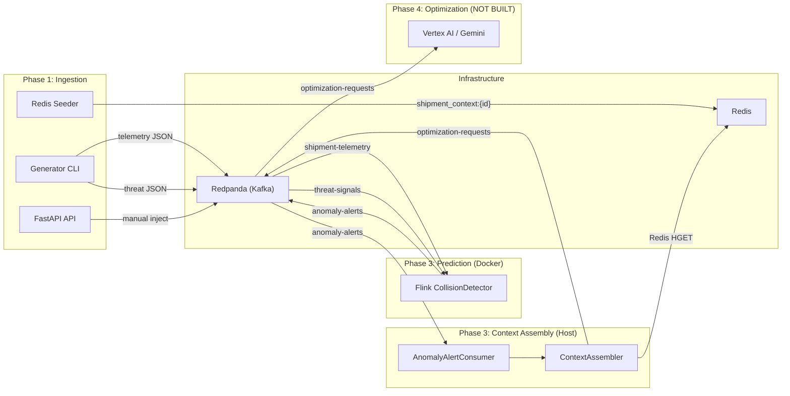

# Logistics Platform — Technical Handoff

Complete walkthrough of Phases 1–3 (Ingestion → Prediction → Context Assembly) and the exact boundary where Phase 4 (Vertex AI Optimization) begins.

---

## System Architecture



---

## Data Flow — Step by Step

### Step 1: Generator produces mock data
**File:** [cli.py](file:///c:/dev/logistics/services/ingestion/cli.py)
**Command:** `python -m services.ingestion generate --shipments 5 --rate 10 --duration 30 --inject-failures`

What happens per tick:
1. `ShipmentSimulator.generate_tick()` advances 5 shipments along real trade corridors (Shanghai→Rotterdam, LA→NY, etc.), applies GPS jitter, emits `ShipmentTelemetrySchema` to `shipment-telemetry` topic
2. Every 5th tick, `ThreatGenerator.generate()` creates a threat polygon. With `--inject-failures`, 10% of threats are **intentionally centered on an active shipment's coordinates** (guaranteed collision)
3. `RouteSeeder` stores 2–4 precomputed fallback routes per shipment in Redis under `shipment_context:{shipment_id}` with a 48h TTL

### Step 2: Flink detects collisions
**File:** [collision_job.py](file:///c:/dev/logistics/services/prediction/flink_job/collision_job.py) (runs inside Docker)

The Flink job is a `CoProcessFunction` that connects two Kafka streams:

```
Stream 1: shipment-telemetry → key_by("global") ─┐
                                                   ├─ CollisionDetector → anomaly-alerts
Stream 2: threat-signals → key_by("global") ──────┘
```

**When a telemetry record arrives** (`process_element1`):
1. Upserts the shipment's latest position in `MapState` (keyed by `shipment_id`)
2. Runs `_evict_expired_threats()` — removes threats older than 10 minutes
3. For each active threat: runs `check_collision(lat, lon, polygon)`

**When a threat arrives** (`process_element2`):
1. Tags with `_ingested_at` timestamp, appends to `ListState`
2. For each known shipment position: runs `check_collision(lat, lon, polygon)`

**The collision check** ([geometry.py](file:///c:/dev/logistics/services/prediction/flink_job/geometry.py)):
1. **Stage 1 (O(1)):** Bounding box filter — if the point isn't even inside the polygon's AABB, skip
2. **Stage 2 (O(n)):** Ray-casting point-in-polygon — cast a horizontal ray, count edge crossings

If collision = true, computes `estimated_delay_hours` using severity × mode multiplier × proximity factor, and emits a JSON alert to `anomaly-alerts`.

### Step 3: Context Assembly enriches alerts
**Files:** [consumer.py](file:///c:/dev/logistics/services/prediction/context_assembly/consumer.py) + [assembler.py](file:///c:/dev/logistics/services/prediction/context_assembly/assembler.py)

> [!IMPORTANT]
> This component is **written and unit-tested but has NOT been run live against infrastructure yet**. It runs as a host Python process, not in Docker.

1. `AnomalyAlertConsumer` subscribes to `anomaly-alerts` topic
2. Deserializes each message → `AnomalyAlertSchema`
3. `ContextAssembler.assemble(alert)`:
   - Queries Redis: `HGET shipment_context:{shipment_id} routes`
   - Parses routes JSON → `list[FallbackRoute]`
   - Merges alert data + routes → `LLMOptimizationRequest`
   - Handles missing context gracefully (empty routes if TTL expired)
4. Publishes `LLMOptimizationRequest` to `optimization-requests` topic

---

## The Phase 4 Boundary

### What's in `optimization-requests` topic

The exact JSON payload that Phase 4 consumes:

```json
{
  "request_id": "uuid",
  "alert_id": "uuid",
  "threat_id": "uuid",
  "threat_type": "WEATHER | CONGESTION | INFRASTRUCTURE",
  "severity": 1-10,
  "estimated_delay_hours": 40.34,
  "collision_coordinates": {"lat": 28.39, "lon": 55.91},
  "shipment_id": "uuid",
  "priority_tier": "LOW | STANDARD | HIGH",
  "transport_mode": "SEA | AIR | ROAD",
  "fallback_routes": [
    {
      "route_id": "uuid",
      "base_cost": 12500.00,
      "estimated_transit_time_hours": 336.5
    }
  ],
  "assembled_at": "2026-04-17T06:00:00Z"
}
```

**Phase 4 needs to:**
1. Consume from `optimization-requests` topic
2. Inject the payload into a Gemini 1.5 Pro zero-shot prompt
3. The LLM evaluates cost/time trade-offs across `fallback_routes`
4. Output: a strict JSON reroute decision (which route to take, why, confidence score)
5. Publish the decision to a new topic (e.g., `reroute-decisions`)

---

## Redpanda Topics

| Topic | Partitions | Producer | Consumer | Schema |
|---|---|---|---|---|
| `shipment-telemetry` | 6 | Ingestion generator/API | Flink | [ShipmentTelemetrySchema](file:///c:/dev/logistics/shared/schemas/telemetry.py) |
| `threat-signals` | 3 | Ingestion generator/API | Flink | [ThreatSignalSchema](file:///c:/dev/logistics/shared/schemas/threats.py) |
| `anomaly-alerts` | 3 | Flink | Context Assembly | [AnomalyAlertSchema](file:///c:/dev/logistics/shared/schemas/anomaly.py) |
| `optimization-requests` | 3 | Context Assembly | **Phase 4 (Vertex AI)** | [LLMOptimizationRequest](file:///c:/dev/logistics/shared/schemas/optimization.py) |

---

## File-by-File Reference

### Shared Schemas (`shared/schemas/`)
| File | What it defines |
|---|---|
| [telemetry.py](file:///c:/dev/logistics/shared/schemas/telemetry.py) | `ShipmentTelemetrySchema`, `LatLon`, `TransportMode`, `PriorityTier` enums |
| [threats.py](file:///c:/dev/logistics/shared/schemas/threats.py) | `ThreatSignalSchema`, `ThreatType` enum |
| [routes.py](file:///c:/dev/logistics/shared/schemas/routes.py) | `PrecomputedRouteSchema` (stored in Redis) |
| [anomaly.py](file:///c:/dev/logistics/shared/schemas/anomaly.py) | `AnomalyAlertSchema` (Flink → Context Assembly) |
| [optimization.py](file:///c:/dev/logistics/shared/schemas/optimization.py) | `LLMOptimizationRequest`, `FallbackRoute` (Context Assembly → Vertex AI) |

### Ingestion Service (`services/ingestion/`)
| File | Purpose |
|---|---|
| [config.py](file:///c:/dev/logistics/services/ingestion/config.py) | `Settings` — all env vars with defaults |
| [cli.py](file:///c:/dev/logistics/services/ingestion/cli.py) | Typer CLI: `generate`, `topics`, `health`, `serve` |
| [producers/kafka.py](file:///c:/dev/logistics/services/ingestion/producers/kafka.py) | `KafkaProducerService` — async producer with typed send methods |
| [generators/telemetry.py](file:///c:/dev/logistics/services/ingestion/generators/telemetry.py) | `ShipmentSimulator` — GPS interpolation along 8 trade corridors |
| [generators/threats.py](file:///c:/dev/logistics/services/ingestion/generators/threats.py) | `ThreatGenerator` — random polygons, configurable failure injection |
| [generators/routes.py](file:///c:/dev/logistics/services/ingestion/generators/routes.py) | `RouteSeeder` — Redis blast-radius cache seeder |
| [api/app.py](file:///c:/dev/logistics/services/ingestion/api/app.py) | FastAPI factory with lifespan-managed Kafka + Redis |

### Prediction Service (`services/prediction/`)
| File | Purpose |
|---|---|
| [config.py](file:///c:/dev/logistics/services/prediction/config.py) | `PredictionSettings` — Kafka, Redis, Flink config |
| [flink_job/collision_job.py](file:///c:/dev/logistics/services/prediction/flink_job/collision_job.py) | Main PyFlink pipeline — Kafka sources, CoProcessFunction, Kafka sink |
| [flink_job/geometry.py](file:///c:/dev/logistics/services/prediction/flink_job/geometry.py) | Pure math: AABB, ray-casting, haversine, delay estimation |
| [context_assembly/consumer.py](file:///c:/dev/logistics/services/prediction/context_assembly/consumer.py) | `AnomalyAlertConsumer` — aiokafka consumer loop |
| [context_assembly/assembler.py](file:///c:/dev/logistics/services/prediction/context_assembly/assembler.py) | `ContextAssembler` — Redis enrichment + payload construction |

### Infrastructure (`infra/`)
| File | Purpose |
|---|---|
| [docker-compose.yml](file:///c:/dev/logistics/infra/docker-compose.yml) | Redpanda + Redis + Flink job (opt-in via `--profile flink`) |
| [flink/Dockerfile](file:///c:/dev/logistics/infra/flink/Dockerfile) | Python 3.10 + JRE 17 + PyFlink 1.18.1 + Kafka connector JAR |

---

## How to Run Everything

### 1. Start infrastructure
```bash
docker compose -f infra/docker-compose.yml up -d          # Redpanda + Redis
docker compose -f infra/docker-compose.yml --profile flink up -d  # + Flink
```

### 2. Create topics (first time only)
```bash
python -m services.ingestion topics
```

### 3. Generate data
```bash
python -m services.ingestion generate --shipments 5 --rate 10 --duration 30 --inject-failures
```

### 4. Verify Flink processing
```bash
docker logs logistics-flink-collision --tail 20
docker exec logistics-redpanda rpk topic describe anomaly-alerts -p  # check HIGH-WATERMARK growth
docker exec logistics-redpanda rpk topic consume anomaly-alerts -n 3  # read actual alerts
```

### 5. Health check
```bash
python -m services.ingestion health
```

---

## Configuration Reference

All config lives in `.env` (see [.env.example](file:///c:/dev/logistics/.env.example)):

| Variable | Default | Used by |
|---|---|---|
| `KAFKA_BOOTSTRAP_SERVERS` | `localhost:19092` | Ingestion, Context Assembly |
| `REDIS_URL` | `redis://localhost:6379/0` | Ingestion, Context Assembly |
| `FLINK_TELEMETRY_GROUP_ID` | `flink-collision-telemetry` | Flink container |
| `FLINK_THREAT_GROUP_ID` | `flink-collision-threats` | Flink container |
| `THREAT_TTL_S` | `600` | Flink — threat expiry (seconds) |
| `WATERMARK_TOLERANCE_MS` | `120000` | Flink — late event tolerance |
| `GENERATOR_NUM_SHIPMENTS` | `50` | CLI generator |
| `GENERATOR_RATE_PER_SEC` | `100` | CLI generator |
| `FAILURE_INJECTION_RATIO` | `0.1` | CLI generator — % of threats overlapping shipments |

---

## Known Quirks

1. **IDE lint errors for `pyflink.*` and `geometry`** — expected. These modules only exist inside the Docker container, not on the host
2. **PyFlink swallows `logging` output inside `CoProcessFunction`** — use `print(flush=True)` if you need visibility from UDF code
3. **Flink consumer group state shows "Empty"** — normal. Flink manages offsets internally via checkpointing and only commits to Kafka periodically
4. **BigQuery warning in Flink logs** — benign. We don't use BigQuery
